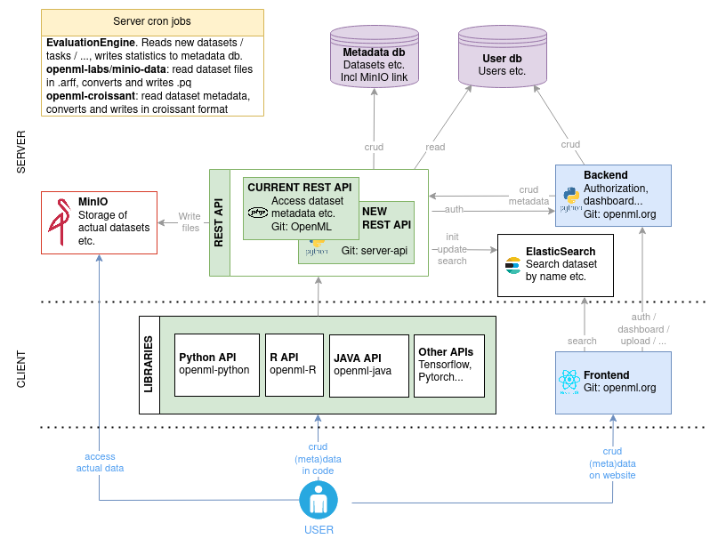

# services
Overview of all OpenML components including a docker-compose to run OpenML services locally

## Overview




## Prerequisites
- Linux/MacOS/Windows (should all work)
- [Docker](https://docs.docker.com/get-docker/) 
- [Docker Compose](https://docs.docker.com/compose/install/) version 2.21.0 or higher

## Usage

You run all OpenML services locally using
```bash
docker compose --profile all up -d
```
Stop it again using 
```bash
docker compose --profile all down
```

### Profiles
You can use different profiles:

- `[no profile]`: databases
- `"elasticsearch"`: databases + elasticsearch
- `"rest-api"`: databases + elasticsearch + REST API
- `"frontend"`: databases + elasticsearch + REST API + frontend
- `"minio"`: database + elasticsearch + REST APP + MinIO + parquet and croissant conversion
- `"all"`: everything

Usage examples:
```bash
docker compose --profile all up -d    # all services
docker compose up -d                  # only the database
docker compose --profile frontend up -d  # Frontend, rest-api, elasticsearch and database
```
Use the same profile for your `down` command.


## Known issues
See the Github Issue list for the known issues.

## Debugging
Some usefull commands:
```bash
docker logs openml-php-rest-api -f              # tail the logs of the php rest api
docker exec -it openml-php-rest-api /bin/bash   # go into the php rest api container
./scripts/connect_db.sql                        # access the database
```

## Endpoints
When you spin up the docker-compose, you'll get these endpoints:
- *Frontend*: localhost:5000
- *Database*: localhost:3306, filled with test data.
- *ElasticSearch*: localhost:9200, filled with test data.
- *Rest API*: localhost:8080
- *Minio*: console at localhost:9001, filled with test data.

## Credentials
The credentials for the database can be found in `config/database/.env`, for minio in `config/minio/.env`, etc.


## Development

### PHP, Parquet and Croissant converter
If you want to do local development on containers that are part of the docker-compose, you want those containers to change based on your code. You should have the relevant code somewhere on your system, you only need to tell the docker-compose where to find it. You can do so by setting environment variables. 

Create a `.env` file inside this directory, and set:

#### PHP
```bash
PHP_CODE_DIR=/path/to/OpenML                  # Root of https://github.com/openml/OpenML on your computer
PHP_CODE_VAR_WWW_OPENML=/var/www/openml       # Always set this to /var/www/openml. Leave empty if you leave PHP_CODE_DIR empty
```

Make sure to create `openml_OS/config/BASE_CONFIG.php` in your local `$PHP_CODE_DIR`. The correct configuration can be found in `config/php.env`. Run docker compose with profile `rest-api`.

#### Parquet
```bash
ARFF_TO_PQ_CODE_DIR=/path/to/minio-data       # Root of https://github.com/openml-labs/minio-data on your computer
ARFF_TO_PQ_APP=/app                           # Always set this to /app. Leave empty if you leave ARFF_TO_PQ_CODE_DIR empty
```

#### Croissant
```bash
CROISSANT_CODE_DIR=/path/to/openml-croissant/python  # Python directory of https://github.com/openml/openml-croissant on your computer
CROISSANT_APP=/app                                   # Always set this to /app. Leave empty if you leave CROISSANT_CODE_DIR empty
```

### Frontend
For the frontend, the easiest way of development is probably just to spin up a local development instance outside of docker, and configure it so that it points towards the endpoints of this docker-compose. Run docker compose with profile `rest-api`.

### Other services
If you want to develop a service that depends on any of the services in this docker-compose, just bring up this docker-compose and point your service to the correct endpoints.